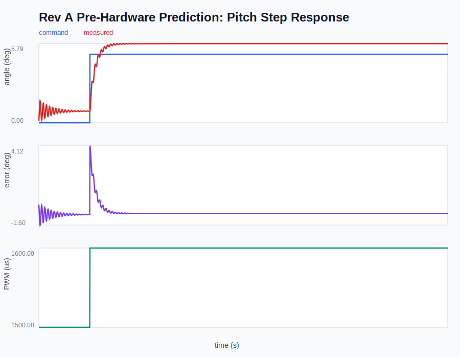
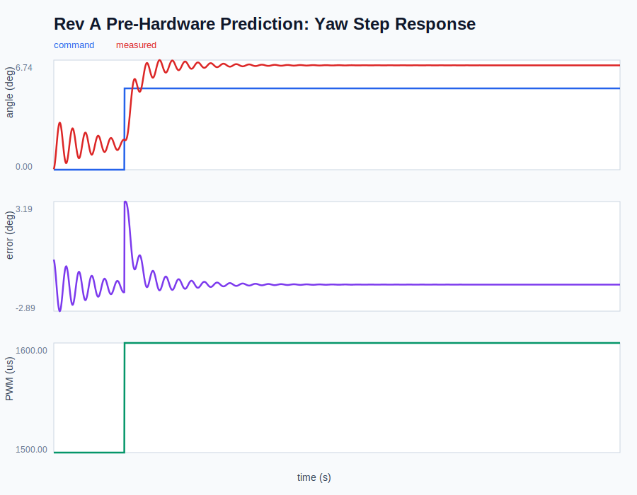

# Figure Index

Fast review guide for the two-axis thrust-vector-control test stand.

## 1. Rev A CAD Baseline


**What it shows:** The full benchtop TVC concept: fixed base, yaw frame, pitch carrier, mock nozzle, servo envelopes, IMU location, wiring/strain-relief concept, and mechanical-stop philosophy.

**Upper-division physical interpretation:** The CAD geometry sets the plant that the controller will see. The moving mass distribution determines `I_axis`; the nozzle and pitch-servo placement create axis-dependent inertia; the center-of-mass offset and cable routing produce quasi-static disturbance moments; and printed-frame stiffness introduces compliance that can appear as additional lag, overshoot, or hysteresis in step-response data.

## 2. Rev A Printable Part Split

[Printable part manifest](cad/rev_a_part_manifest.md)

**What it shows:** The CAD has been split into individually printable parts instead of being left as a single visual model.

**Upper-division physical interpretation:** Separating the parts is not only a manufacturing step. It allows each structural member to be evaluated by load path: base plate for boundary stiffness, yaw frame for out-of-plane bending, pitch carrier for rotating inertia, servo mounts for actuator reaction loads, and hard stops for impact/limit protection. That matters because structural compliance effectively modifies `k` and `c` in the rotational plant equation.

## 3. Pitch Pre-Hardware Step Prediction



**What it shows:** Predicted open-loop pitch-axis command, measured-angle proxy, tracking error, and PWM command before physical hardware data is available.

**Upper-division physical interpretation:** Pitch is expected to be the faster axis because its inertia estimate is lower. For the simplified plant,

```text
I_pitch theta_ddot + c theta_dot + k theta = tau_servo + tau_disturbance
```

lower `I_pitch` gives larger angular acceleration for the same net servo torque. The pre-hardware prediction therefore creates a falsifiable baseline: if real pitch rise time is much slower, the likely missing terms are actuator lag, bearing/gear friction, printed-frame compliance, supply-voltage sag, or underestimated moving inertia.

## 4. Yaw Pre-Hardware Step Prediction



**What it shows:** Predicted yaw-axis response using the larger yaw inertia estimate.

**Upper-division physical interpretation:** Yaw carries the entire pitch subsystem, so `I_yaw` is much larger than `I_pitch`. For the same useful servo torque limit, larger inertia reduces `theta_ddot`, increases settling time, and makes yaw more sensitive to servo phase lag and structural compliance. If yaw measurements are worse than pitch, that is physically expected; the important question is whether the gap is consistent with the estimated mass properties or whether backlash/binding dominates.

## 5. Pre-Hardware Model Parameters

[Pre-hardware model parameters](data/examples/prehardware_model_parameters.json)

**What it shows:** The exact inertia, damping, stiffness, actuator lag, useful torque limit, and disturbance-torque assumptions used to generate the predicted response data.

**Upper-division physical interpretation:** Publishing model assumptions makes the project falsifiable. The first hardware logs can be used to identify whether the dominant error is in mass properties (`I_axis`), dissipative effects (`c`), restoring/compliance effects (`k`), constant bias torque, or actuator bandwidth/saturation. That is the difference between a controls demo and a measured plant-identification workflow.

## 6. Calibration And First-Test Worksheet

[Hardware calibration worksheet](docs/hardware_calibration_worksheet.md)

**What it shows:** The planned procedure for neutral calibration, IMU axis verification, first open-loop steps, pass/investigate criteria, and required photo/video evidence.

**Upper-division physical interpretation:** Calibration is treated as part of the dynamics problem. Neutral offset enters as a trim bias, wire preload enters as a constant or weakly elastic moment, backlash creates approach-direction dependence, and IMU sign/filter errors can destabilize feedback even when the controller law is correct.

## 7. Analysis Pipeline

[Test and analysis workflow](docs/test_and_analysis_workflow.md)

**What it shows:** How raw Pico serial CSV logs become response metrics and plots.

**Upper-division physical interpretation:** Metrics such as rise time, overshoot, settling time, steady-state error, and hysteresis bias are mapped to physical mechanisms instead of being treated as generic plot labels. The pipeline is designed to close the loop from CAD assumptions to measured plant behavior to Rev B design changes.

## 8. Build Readiness Package

[Build readiness checklist](docs/build_readiness_checklist.md)

**What it shows:** The project is prepared for fabrication before parts arrive: print settings, tools, electronics checks, assembly gates, and data readiness are defined.

**Upper-division physical interpretation:** Build readiness protects measurement quality. Print orientation affects stiffness and failure mode, fastener preload affects friction, voltage droop affects useful torque, and wiring preload introduces disturbance moments. Preparing these gates before assembly prevents the first test data from being corrupted by uncontrolled setup variables.

## 9. Rev A Inspection Checklist

[Rev A inspection checklist](docs/rev_a_inspection_checklist.md)

**What it shows:** The plan for measuring purchased servos, printed parts, hard-stop angles, backlash, free play, and mass properties before powered motion.

**Upper-division physical interpretation:** Inspection is a plant-identification step. Dimensional mismatch, frame warping, backlash, and mass-property errors change `I_axis`, `c`, `k`, and `tau_disturbance`; recording them gives context for prediction-versus-measurement discrepancies.

## 10. First Test Report Template

[First test report template](docs/first_test_report_template.md)

**What it shows:** The structure for turning the first hardware run into a formal engineering test report with metadata, setup evidence, raw data, plots, metrics, physical interpretation, anomalies, and Rev B actions.

**Upper-division physical interpretation:** The report template forces the correct aerospace engineering loop: assumption, prediction, measurement, discrepancy, physical cause, and design change. That is the part of the project that demonstrates hardware testing maturity rather than just assembly.
