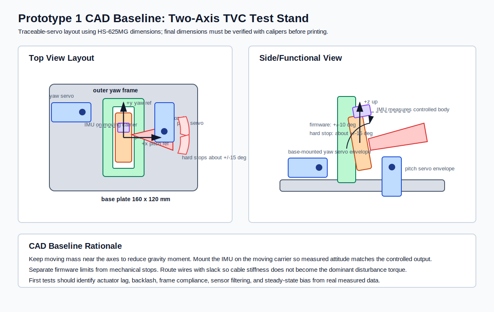

# Two-Axis Thrust Vector Control Test Stand

Hardware GNC portfolio project to design, build, and test a benchtop two-axis thrust-vector-control mechanism from scratch.

## Project Goal

Build a physical two-axis gimbal test stand that points a mock rocket engine/nozzle, measures actuator and attitude response, runs closed-loop control on embedded hardware, and produces real test data.

This project is intentionally hardware-first. The objective is to demonstrate the full engineering loop:

```text
requirements -> CAD -> fabrication -> electronics -> firmware -> calibration -> test data -> iteration
```

## Why This Project

The previous 6-DOF rocket simulator demonstrated nonlinear flight dynamics, TVC allocation, LQR control, actuator dynamics, and robustness verification in software. This project turns that GNC stack into a physical test article.

The portfolio claim this project is designed to support:

> Personally designed, built, tested, and iterated a two-axis TVC hardware test stand with embedded sensing, actuation, closed-loop control, and measured performance data.

## Target Capabilities

| Capability | Target |
| --- | --- |
| Gimbal axes | 2-axis pitch/yaw |
| Angular range | At least `+/-10 deg` mechanical travel |
| Command tracking | Less than `1 deg` steady-state error after calibration |
| Step response | Settling time under `0.5 s` for small commands |
| Sensing | IMU attitude/rate measurement plus actuator command telemetry |
| Control | PID first, then optional model-based/LQR-inspired controller |
| Data logging | CSV logs for command, measured angle, IMU rate, error, and actuator output |
| Demonstration | Video of open-loop step response, closed-loop tracking, and disturbance rejection |

## Prototype 1 Hardware Baseline

Prototype 1 uses the lowest-cost architecture that still supports a real controls experiment. The intent is not to imitate a flight-qualified TVC actuator on the first pass. The intent is to build a benchtop plant with measurable inertia, friction, backlash, actuator saturation, sensor noise, and closed-loop tracking behavior.

| Subsystem | Selection |
| --- | --- |
| Microcontroller | Raspberry Pi Pico-class RP2040 board |
| IMU | BNO085-class fused IMU breakout |
| Actuators | Two Hitec HS-625MG metal-gear PWM servos |
| Power | External regulated `5-6 V` servo supply |
| Structure | 3D printed PLA+/PETG gimbal |
| Control | PID first, model-based comparison later |

Estimated Prototype 1 budget: about `$165-220` before tools, tax, and shipping.

This baseline was selected because it gets to hardware test data quickly while keeping the actuator assumptions defensible: the Pico is sufficient for a `50-100 Hz` embedded control loop, the BNO085 shortens attitude bring-up while still allowing sensor-performance discussion, Hitec HS-625MG servos provide traceable torque/speed/dimension data for CAD and test planning, and a printed structure allows rapid iteration after the first measured step-response and disturbance-rejection tests.

## CAD Baseline

The first CAD baseline is started in [cad/](cad/). It defines the coordinate convention, servo envelope assumptions, two-axis gimbal architecture, mock nozzle carrier, IMU placement, hard-stop philosophy, and Rev A design-review checklist.



Key CAD files:

- [cad/prototype1_parameters.md](cad/prototype1_parameters.md)
- [cad/prototype1_gimbal_baseline.scad](cad/prototype1_gimbal_baseline.scad)
- [cad/prototype1_cad_review.md](cad/prototype1_cad_review.md)
- [cad/rev_a_mass_inertia_estimate.md](cad/rev_a_mass_inertia_estimate.md)
- [cad/rev_a_print_and_assembly_plan.md](cad/rev_a_print_and_assembly_plan.md)
- [cad/rev_a_part_manifest.md](cad/rev_a_part_manifest.md)

Separated Rev A printable part files now live in [cad/parts/](cad/parts/), with rendered STL exports in [cad/exports/rev_a_parts/](cad/exports/rev_a_parts/). Each part is split out so its print orientation and structural role can be reviewed independently before physical fabrication.

Rev A keeps the CAD tied to the rotational plant:

```text
I_axis theta_ddot + c theta_dot + k theta = tau_servo + tau_disturbance
```

Current estimates are `73 g` moving mass and `3.0e-5 kg m^2` inertia for pitch, and `200 g` moving mass and `3.0e-4 kg m^2` inertia for yaw. Those values imply the first hardware tests should focus less on static torque and more on servo bandwidth, deadband, backlash, structural compliance, wire-induced bias, and repeatability.

## Firmware Baseline

The first Pico firmware skeleton is in [firmware/](firmware/), with the bring-up plan in [docs/firmware/firmware_bringup_plan.md](docs/firmware/firmware_bringup_plan.md).

The current firmware implements:

- servo neutral, sweep, and step command modes
- `+/-10 deg` firmware safety clamp
- angle-to-PWM mapping
- CSV telemetry over USB serial
- BNO085 detection/telemetry placeholder
- host-side tests for command limits and profiles

Firmware is treated as part of the physical plant, not just software. PWM commands are only actuator inputs; the measured IMU response will reveal servo deadband, backlash, finite speed, structural compliance, and cable-induced disturbance torques.

## Test And Analysis Pipeline

The verification workflow is documented in [docs/test_and_analysis_workflow.md](docs/test_and_analysis_workflow.md).

Current pipeline:

```text
Pico serial CSV -> data log -> metrics JSON -> response plot -> physical interpretation
```

The repo includes a synthetic step-response example so the analysis stack can be tested before hardware arrives:

- `data/examples/synthetic_pitch_step.csv`
- `data/examples/synthetic_pitch_step.pitch.metrics.json`
- `plots/examples/synthetic_pitch_step_pitch_step_response.svg`

The analysis computes rise time, response delay, overshoot, settling time, steady-state error, peak tracking error, and hysteresis bias. These metrics are interpreted as evidence of actuator bandwidth, deadband, backlash, structural compliance, wire preload, and sensor filtering.

## Week 1 Engineering Basis

The first sizing pass treats the gimbal/nozzle carrier as a rigid body with an offset center of mass. If the moving assembly has mass `m` and its center of mass is offset by `r` from the rotation axis, the static gravity moment is

```text
tau_gravity = m g r
```

Using `m = 0.20 kg` and `r = 0.04 m` gives `tau_gravity = 0.078 N m`, or about `0.80 kg-cm`. With a `3x` static margin, the first servo target is at least `2.4 kg-cm`, so Prototype 1 specifies `>= 5 kg-cm` metal-gear servos to leave margin for friction, cable drag, printed-frame compliance, and transient acceleration torque.

The more important controls question is not only whether the servo can hold the load. A TVC mechanism must track commanded angular deflection with finite bandwidth, limited authority, mechanical deadband, and imperfect sensing. That is why the first hardware tests will measure commanded angle, IMU-measured attitude/rate, settling time, overshoot, repeatability, and any neutral bias caused by wire loads or gimbal friction.

## System Architecture

```text
host computer
  -> sends test profile / receives serial logs

microcontroller
  -> reads IMU
  -> commands two actuators
  -> runs control loop
  -> streams telemetry

mechanical test stand
  -> fixed base
  -> two-axis gimbal
  -> mock engine/nozzle
  -> mechanical stops
```

## Repository Layout

```text
cad/        CAD notes, exported drawings, manufacturing notes
data/       raw test logs
docs/       requirements, safety, architecture, test plans, BOM trade studies
firmware/   embedded controller source and calibration sketches
media/      photos and demo video links
plots/      generated test plots
tests/      analysis scripts and hardware-in-the-loop test notes
```

## Week 0 Deliverables

- [x] Requirements document
- [x] System architecture
- [x] Safety plan
- [x] Preliminary hardware trade study
- [x] Test plan
- [x] Prototype 1 component architecture selected
- [x] Actuator sizing first pass
- [x] Wiring plan
- [x] CAD concept definition
- [x] Vendor shortlist before purchase
- [x] Final servo path selected before ordering
- [x] CAD baseline started
- [x] Rev A mass/inertia estimate
- [x] Rev A print and assembly plan
- [x] Rev A printable part split
- [x] Rev A individual STL exports
- [x] Pico firmware skeleton
- [x] Firmware bring-up plan
- [x] Data capture and analysis pipeline
- [ ] Dimension-verified CAD after parts arrive
- [ ] Hardware servo-neutral test

## Near-Term Build Plan

1. Confirm HS-625MG servo dimensions, spline geometry, and horn package before Rev A CAD.
2. Design first-pass gimbal CAD with mechanical stops.
3. Build firmware skeleton for actuator commands and serial telemetry.
4. Calibrate IMU and actuator neutral positions.
5. Run open-loop step-response tests.
6. Implement closed-loop PID tracking.
7. Document failures, backlash, flex, saturation, noise, and design iterations.

## Safety Scope

This project starts with a mock engine/nozzle only. No live motors, pyrotechnics, high-pressure systems, or combustion hardware are part of the initial test stand.

The test article is a controls and mechanisms platform, not a propulsion test.
